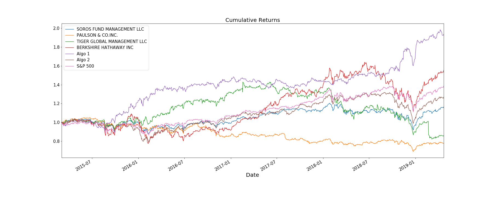
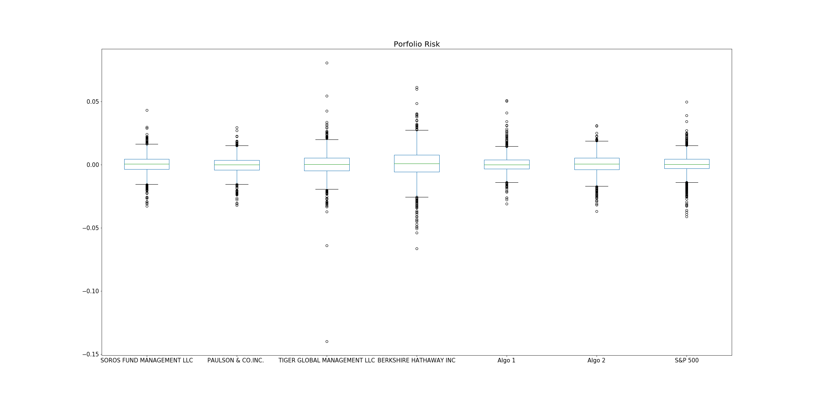

# Unit 4 Homework Assignment: A Whale Off the Port(folio)

## Performance Analysis

1. Calculate and plot cumulative returns. Does any portfolio outperform the S&P 500?

Based on the cumulative returns plot, there is no portfolio that outperformed the S&P 500 from Mar 2015 to Apr 2019, except a slight better-off in Berkshire Hathaway portfolio during the first half year of 2018. 

## Risk Analysis

1. Create a box plot for each of the returns. Which box has the largest spread? Which has the smallest spread?

Based on the box plot, Berkshire Hathaway has the largest spread, and Paulson has the smallest spread. 

2. Calculate the standard deviation for each portfolio. Which portfolios are riskier than the S&P 500?

SOROS FUND MANAGEMENT LLC      0.007895\
PAULSON & CO.INC.              0.007023\
TIGER GLOBAL MANAGEMENT LLC    0.010894\
BERKSHIRE HATHAWAY INC         0.012919\
Algo 1                         0.007620\
Algo 2                         0.008342\
S&P 500                        0.008554

Based on the standard deviation, Berkshire Hathaway and Tiger Global are riskier than S&P 500. 

3. Calculate the annualized standard deviation (252 trading days).

SOROS FUND MANAGEMENT LLC      0.125335\
PAULSON & CO.INC.              0.111488\
TIGER GLOBAL MANAGEMENT LLC    0.172936\
BERKSHIRE HATHAWAY INC         0.205077\
Algo 1                         0.120967\
Algo 2                         0.132430\
S&P 500                        0.135786

## Rolling Statistics

1. Plot the rolling standard deviation of the various portfolios along with the rolling standard deviation of the S&P 500 using a 21 day rolling window. Does the risk increase for each of the portfolios at the same time risk increases in the S&P?

Based on the rolling standard deviations, Soros, Paulson, Algo1 and Algo2 risk increase quite in line with risk increase of S&P 500; Berkshire's volatility also moves roughly along with S&P 500, though it is a lot more volatile in the second half year of 2018; Tiger Global is relatively different as its risk peaked in Mar 2017 and Mar 2019 whereas S&P 500 volatility was low during those times. 

2. Construct a correlation table for the algorithmic, whale, and S&P 500 returns. Which returns most closely mimic the S&P?

Based on the correlation table, Algo2 is most correlated to and closely mimic the S&P. 

3. Choose one portfolio and plot a rolling beta between that portfolio's returns and S&P 500 returns. Does the portfolio seem sensitive to movements in the S&P 500?

Based on the rolling beta, Berkshire Hathaway portfolio seems very sensitive to S&P 500 movements because for most of the time, portfolio would move 1.2% to 1.5% given 1% move in S&P 500. 

4. An alternative way to calculate a rolling window is to take the exponentially weighted moving average. This is like a moving window average, but it assigns greater importance to more recent observations. Try calculating the ewm with a 21 day half-life.

## Plot Sharpe Ratios

1. Using the daily returns, calculate and visualize the Sharpe ratios using a bar plot.

2. Determine whether the algorithmic strategies outperform both the market (S&P 500) and the whales portfolios.

Based on the sharpe ratios, Algo1 outperformed both market and whales but Algo2 did not. 

## Create Custom Portfolio

5. Add your portfolio returns to the DataFrame with the other portfolios and rerun the analysis. How does your portfolio fair?

Based on the data summary and visualization, my custom portfolio, which is AAPL, TSLA and JNJ being equally weighted, shows 68% correlation to S&P with 21% annual volatility. Although risk is higher than 13% in market, the sharpe ratio does not improve at all compared to S&P 500, indicating unnecessary risk exposure without higher returns. The custom portfolio performs very similarly to Berkshire Hathaway portfolio.
